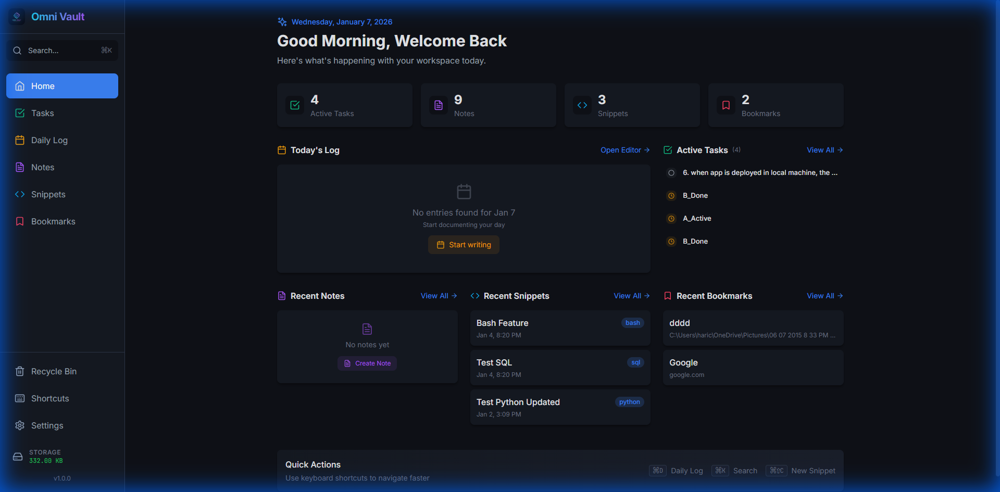
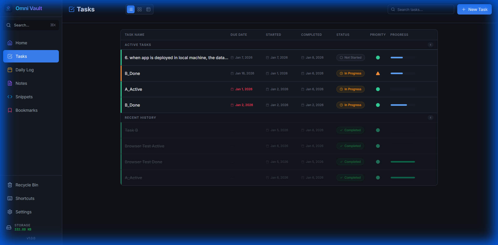
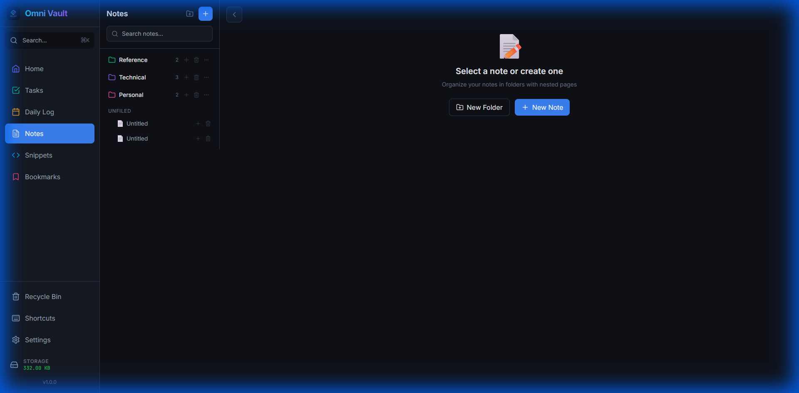
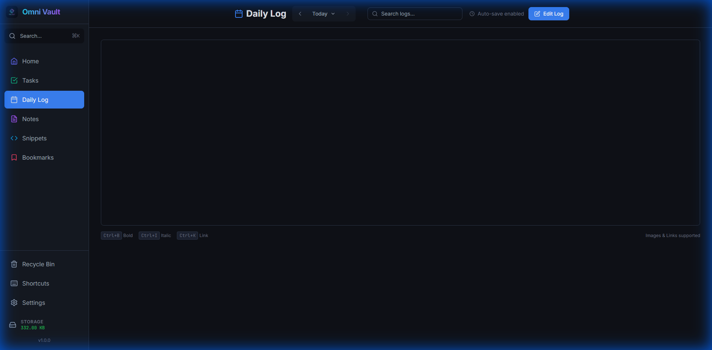
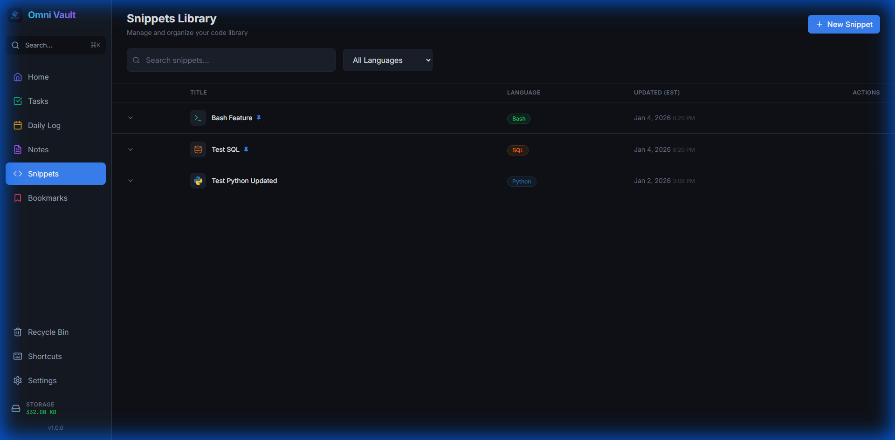
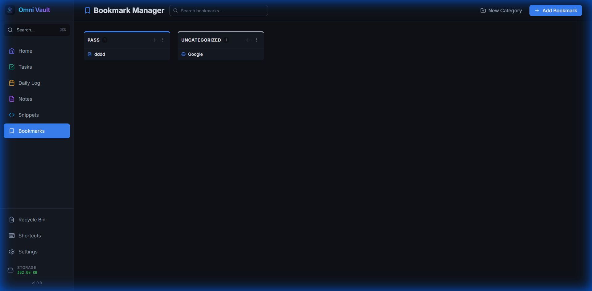

<div align="center">

# 🎯 MyTasker (Omni Vault)

### A dark-mode, local-first productivity app for data engineers

**Built with React, TypeScript, FastAPI, and SQLite**

[](https://github.com/Harics88/MyTasker/actions)
[](https://opensource.org/licenses/MIT)
[](https://github.com/Harics88/MyTasker/releases)

[Download](#-download) • [Features](#-features) • [Screenshots](#-screenshots) • [Tech Stack](#-tech-stack) • [Getting Started](#-getting-started)

</div>

---

## 📦 Download

### **🖥️ Desktop Application (Recommended)**

Get the standalone desktop app - no Docker or Python required!

**📥 [Download Latest Release (v1.0.0)](https://github.com/Harics88/MyTasker/releases/latest)**

- **Windows:** `Omni-Vault_1.0.0_x64_en-US.msi` or `Omni-Vault_1.0.0_x64-setup.exe`
- **macOS:** Coming soon
- **Linux:** Coming soon

**Installation:**
1. Download the installer for your platform
2. Run the installer and follow the wizard
3. Launch "Omni Vault" from your applications
4. Your data is stored locally - 100% private!

---

## ✨ Features

### 🏠 **Dashboard**
- Quick stats overview (Active Tasks, Notes, Snippets, Bookmarks)
- Recent activity feed across all sections
- Direct navigation to any entity
- Real-time updates

### 📝 **Daily Log**
- Notebook-style editor with rich text support
- Auto-save enabled
- Inline linking via `@` mention (tasks, notes, snippets, bookmarks)
- Code snippet formatting with syntax highlighting
- Date navigation (previous/next days)

### ✅ **Tasks**
- **Multiple view modes:** List, Board (Kanban), and Table
- **Status tracking:** Not Started / In Progress / Done
- **Priority levels:** Low, Medium, High
- **Subtasks** with drag-and-drop reordering
- Full-screen task detail popout
- Date tracking: Due Date, Started At, Completed At

### 📄 **Notes**
- Hierarchical folder structure with drag-and-drop
- Rich text editor with full formatting support
- **Soft delete** with Recycle Bin
- Bulk operations (restore, delete, empty bin)
- Full-text search
- Breadcrumb navigation

### 💻 **Code Snippets**
- Syntax highlighting for 20+ languages
- One-click copy functionality
- Language filtering
- Description and metadata support
- Search across all snippets

### 🔖 **Bookmarks**
- Categorized organization with custom colors
- Support for both web URLs and local file paths
- Quick search across all bookmarks
- Category-based grouping
- External link support with automatic URL validation

### 🔍 **Global Search**
- `Cmd/Ctrl+K` to open
- Search across all entities (tasks, notes, snippets, bookmarks, daily logs)
- Keyboard navigation
- Quick preview and navigation

---

## 📸 Screenshots

### Dashboard - Your Command Center

*Quick overview of all your productivity metrics and recent activity*

### Tasks - Organized and Prioritized

*Powerful task management with multiple views, priorities, and status tracking*

### Notes - Hierarchical Knowledge Base

*Organized note-taking with folders, rich text editing, and search*

### Daily Log - Your Personal Journal

*Free-form daily logging with rich text and inline linking*

### Code Snippets - Your Code Library

*Syntax-highlighted code snippets with easy copy and organization*

### Bookmarks - Quick Access to Everything

*Categorized bookmarks for web links and local files*

---

## 🛠️ Tech Stack

### **Frontend**
- **React 18** + **TypeScript** - Modern UI framework
- **Vite** - Lightning-fast build tool
- **Tailwind CSS** - Utility-first styling
- **React Query (TanStack Query)** - Data fetching & caching
- **React Router v6** - Client-side routing
- **TipTap** - Rich text editor
- **Lucide Icons** - Beautiful icon set
- **Prism** - Syntax highlighting
- **date-fns** - Date utilities

### **Backend**
- **FastAPI** - Modern Python web framework
- **SQLAlchemy 2.0** - Async ORM
- **SQLite** - Local-first database
- **Pydantic v2** - Data validation
- **Uvicorn** - ASGI server

### **Desktop**
- **Tauri v2** - Lightweight desktop framework
- **Rust** - Native performance

### **DevOps**
- **Docker & Docker Compose** - Containerization
- **GitHub Actions** - CI/CD automation

---

## 🚀 Getting Started

### **Option 1: Desktop App (Easiest)**

Perfect for end-users who just want to use the app:

1. **[Download the installer](https://github.com/Harics88/MyTasker/releases/latest)**
2. **Install and run** - that's it! ✨
3. Your data is stored locally in your user directory

---

### **Option 2: Docker (For Developers)**

Quick start with Docker Compose:

```bash
# Clone the repository
git clone https://github.com/Harics88/MyTasker.git
cd MyTasker

# Start with Docker Compose
docker-compose up --build

# Access the app
# Frontend: http://localhost:3001
# API Docs: http://localhost:8000/docs
```

---

### **Option 3: Local Development (Advanced)**

For developers who want to modify the code:

**Backend:**
```bash
cd backend
python -m venv venv
source venv/bin/activate  # On Windows: venv\Scripts\activate
pip install -r requirements.txt
uvicorn app.main:app --reload --host 0.0.0.0 --port 8000
```

**Frontend:**
```bash
cd frontend
npm install
npm run dev
# Access at http://localhost:5173
```

---

## ⌨️ Keyboard Shortcuts

| Shortcut | Action |
|----------|--------|
| `Cmd/Ctrl + D` | Go to today's daily log |
| `Cmd/Ctrl + K` | Open global search |
| `Cmd/Ctrl + Shift + C` | Create new snippet |
| `Cmd/Ctrl + Shift + H` | Go to Home |
| `Cmd/Ctrl + Shift + T` | Go to Tasks |
| `Cmd/Ctrl + Shift + N` | Go to Notes |
| `Cmd/Ctrl + Shift + S` | Go to Snippets |
| `Cmd/Ctrl + Shift + B` | Go to Bookmarks |
| `Escape` | Close modals/panels |

---

## 📁 Project Structure

```
MyTasker/
├── frontend/                 # React + TypeScript frontend
│   ├── src/
│   │   ├── components/      # Reusable UI components
│   │   ├── pages/           # Page components
│   │   ├── hooks/           # Custom React hooks
│   │   └── lib/             # API client & utilities
│   └── src-tauri/           # Tauri desktop app
│       ├── src/             # Rust code
│       └── icons/           # App icons
│
├── backend/                  # FastAPI + SQLAlchemy backend
│   └── app/
│       ├── routers/         # API endpoints
│       ├── models.py        # Database models
│       └── schemas.py       # Pydantic schemas
│
├── screenshots/             # App screenshots
├── docker-compose.yml       # Docker setup
└── .github/workflows/       # CI/CD pipelines
```

---

## 🎨 Design System

### **Color Palette**
```css
--background: #0F1117;         /* Main background */
--background-card: #151922;    /* Card background */
--accent-blue: #3B82F6;        /* Primary accent */
--accent-amber: #F59E0B;       /* In Progress */
--accent-green: #22C55E;       /* Completed */
--accent-red: #EF4444;         /* High priority */
--accent-purple: #8B5CF6;      /* Notes/folders */
```

### **Typography**
- **Font Family:** Inter (400, 500, 600, 700)
- **Code Font:** JetBrains Mono
- **Base Size:** 16px

---

## 🗄️ Database Schema

Built on SQLite with the following tables:
- `daily_logs` - Daily journal entries
- `tasks` - Task items with status & priority
- `subtasks` - Nested subtasks
- `notes` - Rich text notes with soft delete
- `sections` - Hierarchical note folders
- `snippets` - Code snippets with language metadata
- `bookmarks` - Web and file bookmarks
- `bookmark_categories` - Bookmark organization

---

## 🆕 Recent Updates

### **v1.0.0 (January 2026)**
- ✅ Desktop application with Tauri v2
- ✅ Automated builds with GitHub Actions
- ✅ Dashboard with real-time stats
- ✅ Hierarchical note folders with drag-and-drop
- ✅ Recycle Bin with bulk operations
- ✅ Full-screen task popout view
- ✅ Task table view with multiple display modes
- ✅ Bookmark categories with custom colors
- ✅ Local file bookmark support

---

## 📄 API Documentation

Interactive API docs available at:
- **Swagger UI:** `http://localhost:8000/docs`
- **ReDoc:** `http://localhost:8000/redoc`

### **Key Endpoints**
- `GET /api/system/stats` - System statistics
- `GET /api/daily-logs/today` - Today's log
- `GET /api/tasks` - List tasks
- `GET /api/notes` - List notes
- `GET /api/snippets` - List snippets
- `GET /api/bookmarks` - List bookmarks
- `GET /api/search?q={query}` - Global search

See [API Documentation](docs/API.md) for complete endpoint reference.

---

## 🤝 Contributing

This is a personal productivity tool, but suggestions and bug reports are welcome!

1. Fork the repository
2. Create your feature branch (`git checkout -b feature/AmazingFeature`)
3. Commit your changes (`git commit -m 'Add some AmazingFeature'`)
4. Push to the branch (`git push origin feature/AmazingFeature`)
5. Open a Pull Request

---

## 📜 License

This project is licensed under the MIT License - see the [LICENSE](LICENSE) file for details.

---

## 🙏 Acknowledgments

- Built with ❤️ for data engineers who love local-first apps
- Inspired by modern productivity tools like Notion and Obsidian
- Special thanks to the open-source community

---

<div align="center">

**Star ⭐ this repo if you find it useful!**

[Report Bug](https://github.com/Harics88/MyTasker/issues) • [Request Feature](https://github.com/Harics88/MyTasker/issues)

Made with ❤️ by [Harics88](https://github.com/Harics88)

</div>
